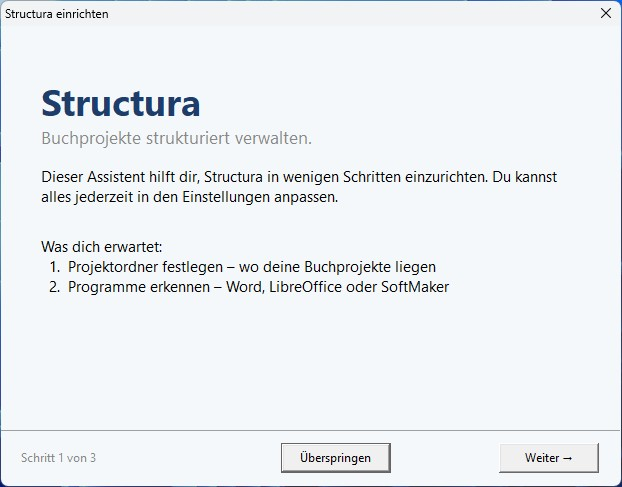
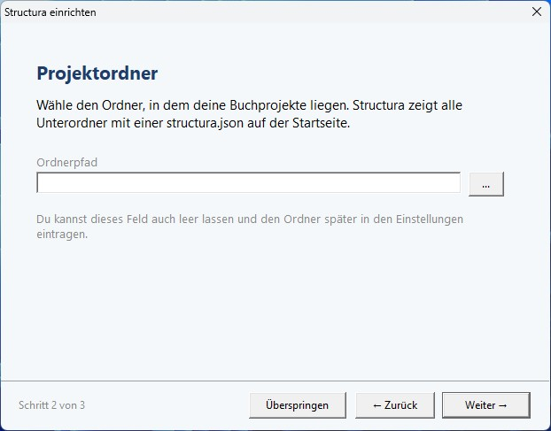
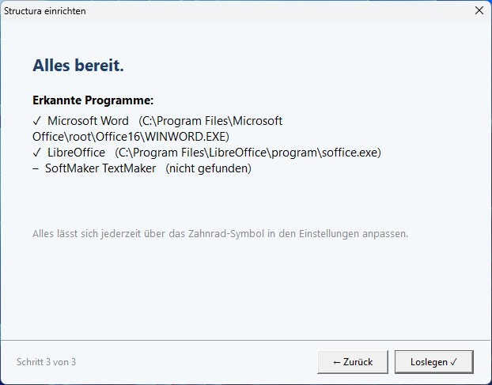
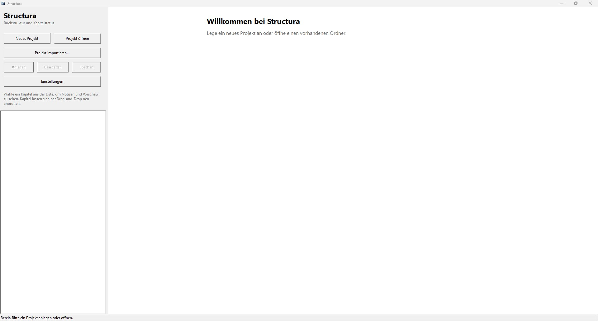
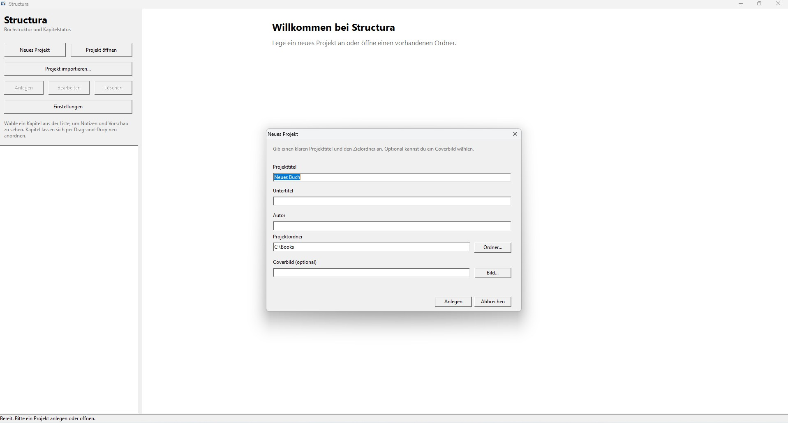
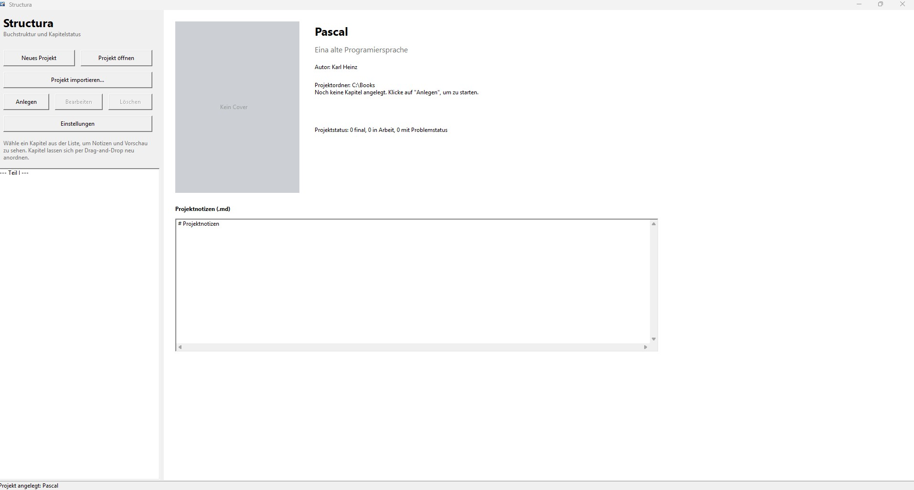
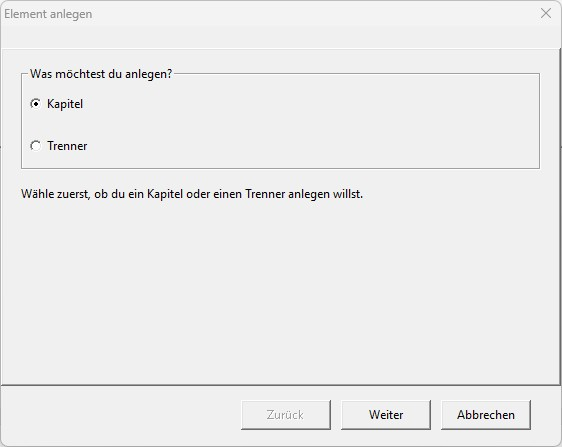
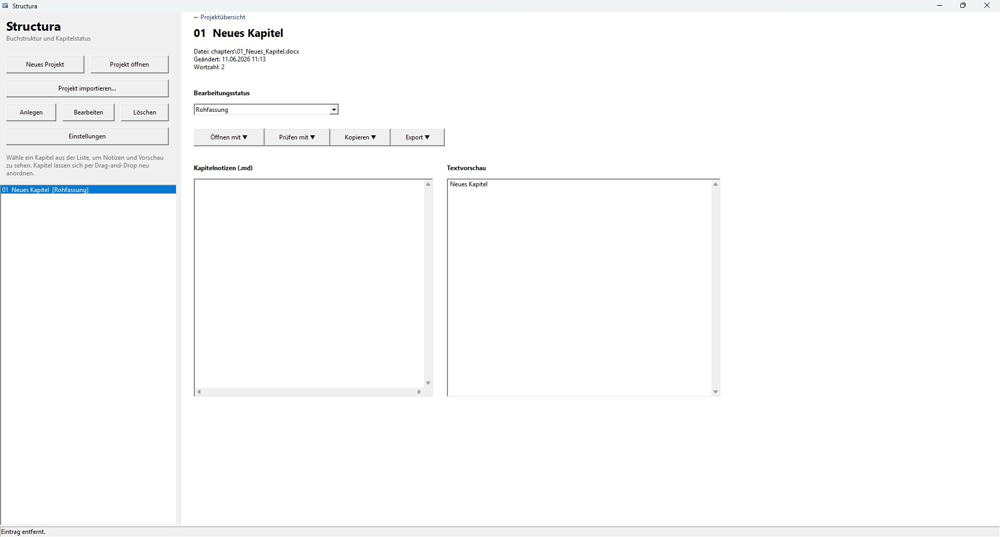

# First steps with Structura

This guide walks through the complete workflow from first launch to a working book project with chapters.

---

## 1. Install

Download the latest `Structura-vX.X.X-windows-x64.zip` from the [Releases page](https://github.com/DKFuH/Structura/releases). Extract the ZIP to any folder and run `Structura.exe`. No installer, no registry entries.

---

## 2. First-launch wizard

Structura opens a three-step setup wizard on the first start.

**Step 1 — Welcome**



An overview of what the wizard covers. Click **Weiter →** to proceed or **Überspringen** to skip and configure everything manually later via Settings.

**Step 2 — Root folder (Projektordner)**



Choose a folder on your computer that will act as the container for all your book project subfolders. A good example is `C:\Books` or `D:\Manuscripts`. Structura scans this folder on every startup and shows all subfolders that contain a `structura.json` file as projects on the home screen.

You can leave this field empty and set it later in Settings.

**Step 3 — Done (Alles bereit)**



Structura reports which office tools it found. Microsoft Word and LibreOffice are shown with their detected paths. If a program is not installed, it appears as "nicht gefunden". Click **Loslegen ✓** to start.

---

## 3. Create your first project



Click **Neues Projekt** in the sidebar. The new project dialog opens.



| Field | Description |
|---|---|
| **Projekttitel** | The display name for the project. Used as the window title and in the project overview. |
| **Untertitel** | Optional subtitle shown in the project view. |
| **Autor** | Author name shown in the project view. |
| **Projektordner** | The subfolder where this project will be stored. Pre-filled with the root folder from setup. Click **Ordner...** to pick a different location. |
| **Coverbild** | Optional image file shown in the project view. JPG or PNG. Click **Bild...** to browse. |

Click **Anlegen** to create the project. Structura creates the subfolder with the following structure:

```
YourProjectTitle/
├── structura.json      ← project metadata and chapter list
├── chapters/           ← chapter DOCX files
├── notes/              ← Markdown notes (project.md + per-chapter notes)
├── backup/             ← automatic safety copies
├── preview/            ← text preview output
└── export/             ← master export output
```

---

## 4. Add chapters and dividers



With a project open, click **Anlegen** in the sidebar. A dialog asks what you want to create.



**Kapitel (Chapter)**
A chapter represents one section of your manuscript. Structura creates a numbered DOCX file in `chapters/` and adds the chapter to the project list. You give it a title — the file is named automatically from that title, for example `01_Einleitung.docx`.

**Trenner (Divider)**
A divider marks a structural break such as a part heading or a section separator. It has a title but no DOCX file. Useful for organizing chapters into parts.

Chapters and dividers can be reordered in the sidebar using drag and drop. Structura renumbers the DOCX filenames automatically when the order changes.

---

## 5. Work with a chapter



Click a chapter in the sidebar to open its detail view on the right.

**Status dropdown**
Set the editing status of the chapter: Rohfassung, Überarbeitung, Lektorat, or Final. The status appears as a label next to the chapter title in the sidebar.

**Öffnen mit**
Opens the chapter DOCX in the configured office application. If multiple tools are detected, a dropdown lets you choose between Word, LibreOffice, and TextMaker.

**Prüfen mit**
Opens a writing or proofreading tool. Options include Grammarly, LanguageTool, or ChatGPT depending on your workflow button configuration. The chapter text is copied to the clipboard automatically before the tool opens.

**Kopieren**
Copies the chapter text to the clipboard for pasting into any external tool.

**Export**
Generates a master export that combines all chapters in order. The result is placed in the `export/` subfolder.

**Kapitelnotizen (.md)**
A Markdown text field for notes, tasks, or research tied to this chapter. Saved automatically to `notes/` as a `.md` file.

**Textvorschau**
Shows the raw extracted text from the DOCX file. Updated when the file changes on disk. This preview does not require Word or LibreOffice.

---

## 6. Open an existing project

Click **Projekt öffnen** in the sidebar and navigate to a folder that contains a `structura.json` file. Structura loads the project and adds it to the recent projects list.

Alternatively, use **Projekt importieren...** to import a folder of DOCX files that does not yet have a `structura.json`. Structura creates the metadata file and adds the existing DOCX files as chapters in alphabetical order.

---

## 7. Settings

Click **Einstellungen** in the sidebar to open the settings dialog.

- **Root folder** — the folder Structura scans for projects on startup.
- **Office tool paths** — override the auto-detected paths for Word, LibreOffice, and TextMaker.
- **Workflow buttons** — configure what the Prüfen mit and Kopieren buttons do.

---

## Tips

- The `structura.json` file is plain JSON and human-readable. You can open it in any text editor if you need to inspect or fix the project metadata.
- Chapter DOCX files in the `chapters/` folder are normal DOCX files. You can edit them outside Structura at any time. The preview and word count update the next time you open the chapter in Structura.
- The `backup/` folder contains safety copies created before Structura performs renaming or reordering operations. You can delete these manually if disk space is a concern.
- If you move a project folder to a different location, open it again with **Projekt öffnen**. Structura stores relative paths inside `structura.json`, so the project structure remains intact after a move.
